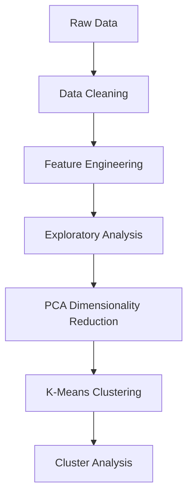

# Customer Segmentation using Machine Learning 🛒📊


## Project Overview
This machine learning project segments international customers based on purchasing behavior to enable targeted marketing strategies and improve customer retention.

## Key Features
- 🧹 Comprehensive data preprocessing pipeline
- 📊 Exploratory data analysis (EDA) visualizations
- 🤖 K-Means clustering implementation
- 🔍 PCA for dimensionality reduction
- 📈 Customer behavior pattern identification

## Dataset
The dataset contains **35,116 transactions** from **37 countries** with the following features:

| Feature | Description |
|---------|-------------|
| InvoiceNo | Unique invoice identifier |
| InvoiceDate | Date and time of purchase |
| StockCode | Product identifier |
| Description | Product description |
| Quantity | Number of items purchased |
| UnitPrice | Price per item (GBP) |
| CustomerID | Unique customer identifier |
| Country | Customer location |

## Technical Approach


## Installation
1. Clone the repository:
```bash
git clone https://github.com/yourusername/Customer-Segmentation-using-Machine-Learning.git
cd Customer-Segmentation-using-Machine-Learning
```

2. Create and activate virtual environment:
```bash
python -m venv venv
source venv/bin/activate  # Linux/Mac
venv\Scripts\activate  # Windows
```

3. Install dependencies:
```bash
pip install -r requirements.txt
```

## Usage
Run the complete analysis pipeline:
```bash
python run_analysis.py
```

Or execute individual steps:
```bash
python src/data_preprocessing.py
python src/exploratory_analysis.py
python src/clustering.py
```

## Results
Sample cluster visualization:


Key findings:
- Identified **5 distinct customer segments**
- Discovered **3 high-value customer groups**
- Revealed **purchase patterns** by geography

## Requirements
See complete list in [requirements.txt](https://github.com/HarikrishnaRao14/Customer-Segmentation/blob/main/requirment.txt)

## Contributing
Contributions welcome! Please follow these steps:
1. Fork the repository
2. Create your feature branch (`git checkout -b feature/your-feature`)
3. Commit your changes (`git commit -m 'Add some feature'`)
4. Push to the branch (`git push origin feature/your-feature`)
5. Open a Pull Request

## License
Distributed under the MIT License. See `LICENSE` for more information.


**To Customize:**
1. Replace placeholder links with your actual GitHub URL
2. Add your contact information
3. Include actual visualization images
4. Update the requirements.txt reference if needed
5. Modify the technical approach diagram if your process differs
